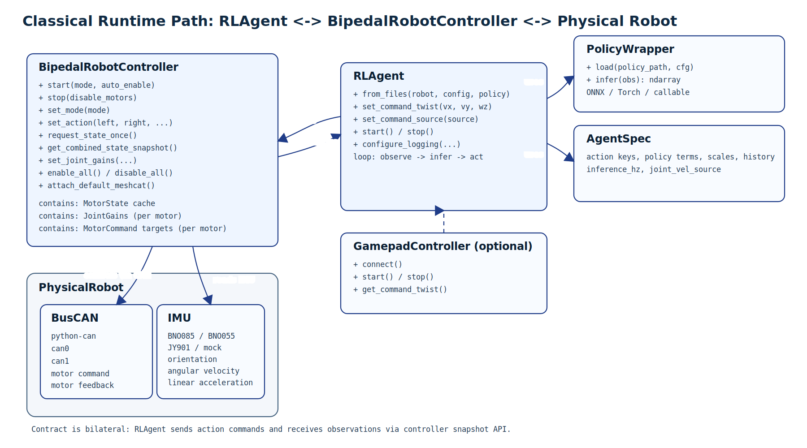
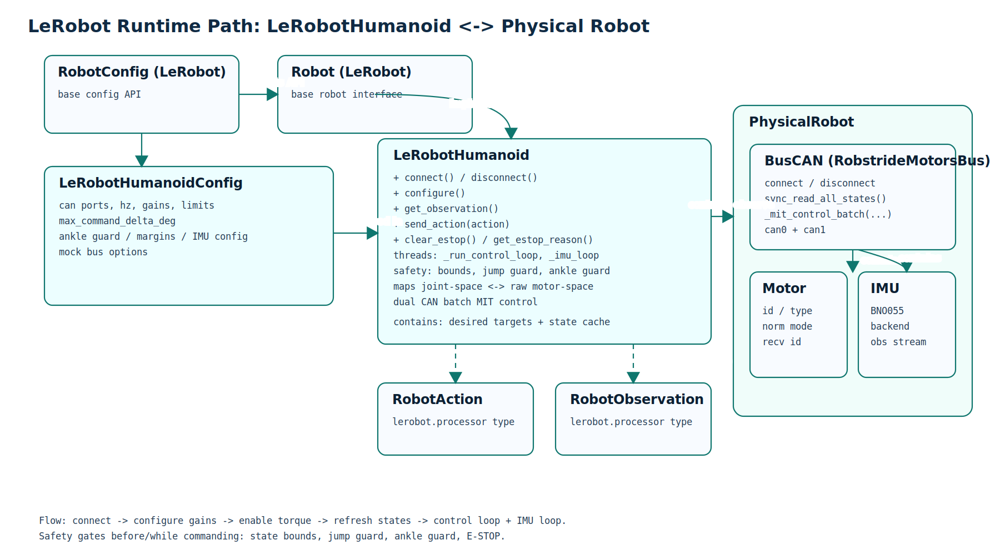
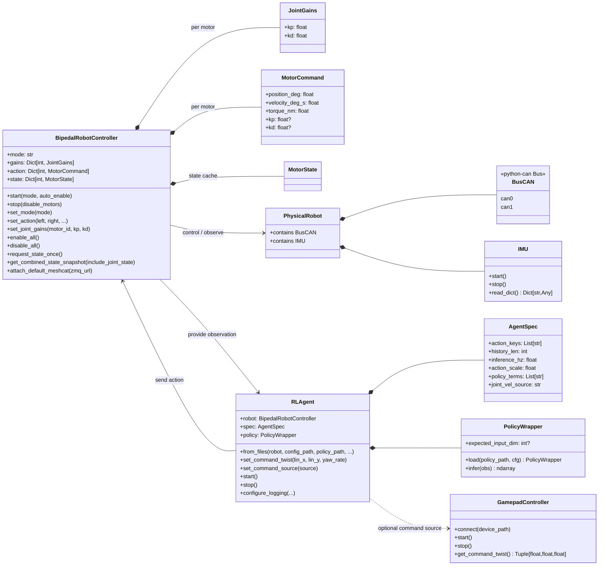
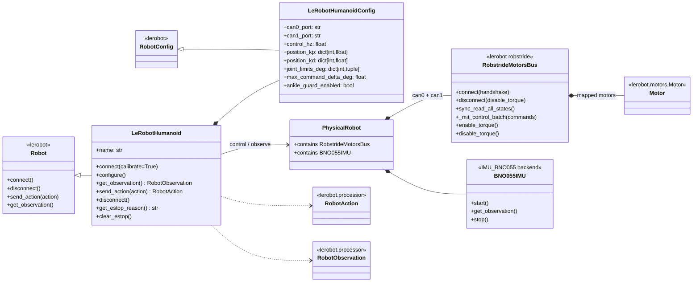

# Architecture Class Diagrams

This document covers the two runtime control paths in this repository:

1. Classical controller: `BipedalRobotController` + `RLAgent`
2. LeRobot integration: `LeRobotHumanoid`

Vector assets:
- [`docs/diagrams/classical_controller_architecture.svg`](./docs/diagrams/classical_controller_architecture.svg)
- [`docs/diagrams/lerobot_integration_architecture.svg`](./docs/diagrams/lerobot_integration_architecture.svg)

Rendered preview:

## 1) Classical Controller + RLAgent

### Runtime behavior (classical path)
- `BipedalRobotController` runs its own control/state loop thread (`_run_loop`).
- `RLAgent` runs its own inference loop thread (`_run_loop`) and calls:
  - `robot.get_combined_state_snapshot(...)` (observation path)
  - `robot.set_action(...)` (action path)
- `GamepadController` is optional and provides command twist to `RLAgent`.

## 2) LeRobot Integration Path

### Runtime behavior (LeRobot path)
- `LeRobotHumanoid.connect()`:
  - connects both Robstride CAN buses,
  - writes gains (`configure()`),
  - optionally enables torque,
  - starts IMU thread,
  - starts control loop thread (`_run_control_loop`).
- In the diagram, these hardware interfaces are grouped under `PhysicalRobot` (CAN buses + IMU).
- `send_action(...)` updates desired raw targets with safety checks (bounds, jump guard, ankle guard, E-STOP).
- Control loop reads motor states and sends batched MIT commands on both buses in parallel.

## Script-level entry points using these classes
- Classical path:
  - `deploy/run_real_policy_sequential.py`
- LeRobot path:
  - `tools/data_acquisition.py`
  - direct usage via `lerobot_humanoid_lerobot_integration`
