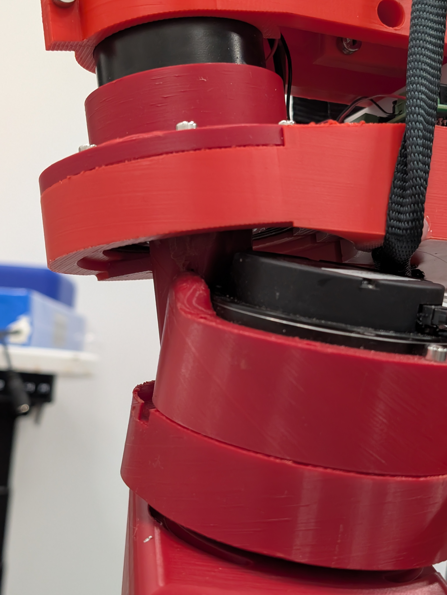
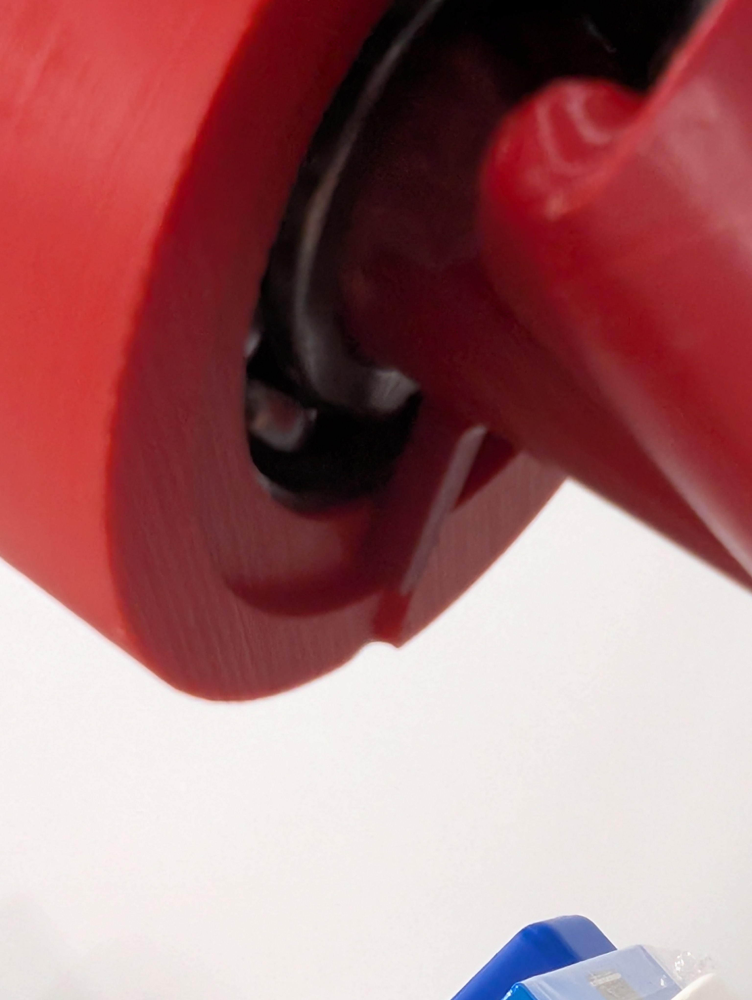
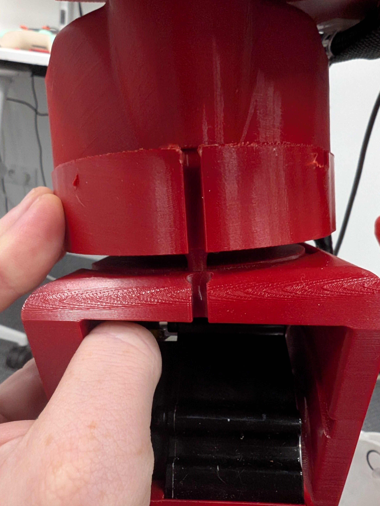
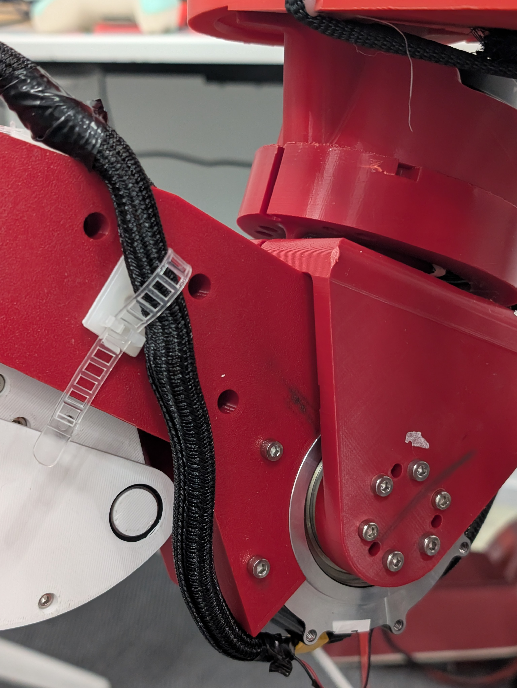
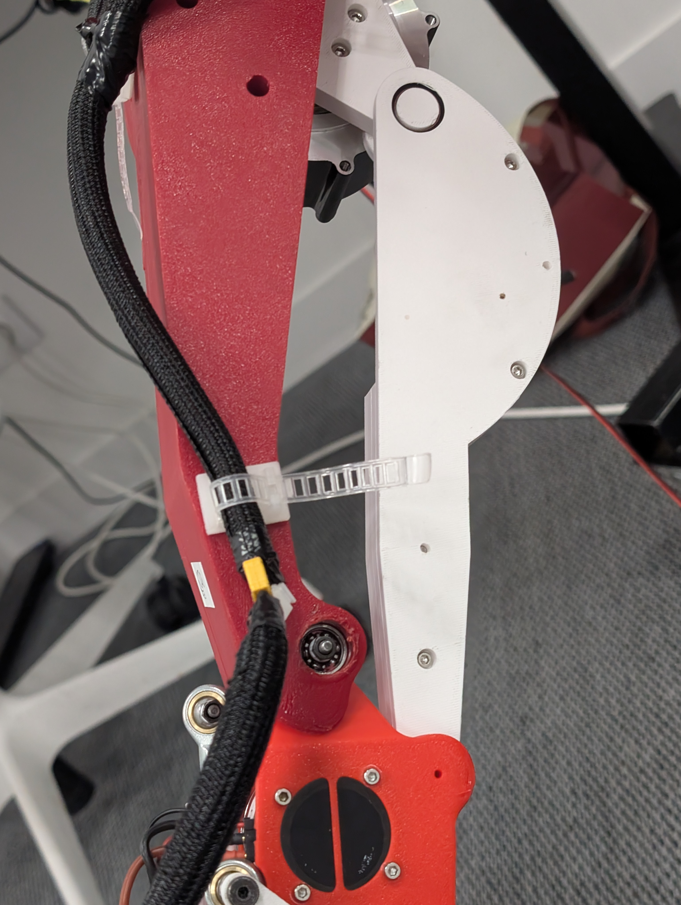

# Calibration Guide

This document defines the calibration workflow for `lerobot_humanoid_runtime`.

Calibration is mandatory before deployment on real hardware.

## 1. Scope

This guide covers:
- transport checks (CAN and IMU),
- motor sign and offset validation,
- joint limit validation,
- startup safety checks,
- acceptance criteria for go/no-go.

Primary runtime controller used for calibration:
- [`robot/bipedal_robot.py`](./robot/bipedal_robot.py)

LeRobot integration uses the same physical robot assumptions and must be consistent with calibration outcomes:
- [`lerobot_humanoid_lerobot_integration/lerobot_humanoid.py`](./lerobot_humanoid_lerobot_integration/lerobot_humanoid.py)

## 2. Safety Rules (Hard Requirements)

- Start in `state_only` mode first.
- Do not bypass E-STOP logic.
- Keep one person on power cutoff during calibration.
- Command only small motions until all checks pass.
- Never run full policy before sign/offset/limits validation.

## 3. Platform and Environment

- Raspberry Pi 5 + Ubuntu.
- Python 3.13 recommended.
- Dependency management via `uv`.

Setup:

```bash
uv sync --extra full
```

## 4. Robot Bring-Up Order

1. Power robot.
2. Power Raspberry Pi.
3. Bring up CAN interfaces (if not auto-started):

```bash
sudo ip link set can0 up type can bitrate 1000000 dbitrate 5000000 fd on
sudo ip link set can1 up type can bitrate 1000000 dbitrate 5000000 fd on
```

4. Optionally start MeshCat server (if needed in your setup):

```bash
meshcat-server
```

## 4.1 Manual Zeroing (First Start / Re-zero)

Use this section when you need to send motor zero commands (`CAN_CMD_ZERO`) after manually placing joints at known reference poses.

Reference assets used below are stored in this repo:
- `docs/calibration_assets/zero_refs/hipz_zeros1.jpg`
- `docs/calibration_assets/zero_refs/hipz_zero2.jpg`
- `docs/calibration_assets/zero_refs/hipx_zero.jpg`
- `docs/calibration_assets/zero_refs/hipy_zero.jpg`
- `docs/calibration_assets/zero_refs/knee_zero.jpg`
- `docs/calibration_assets/zero_refs/ankle_zero2.jpg`
- `docs/calibration_assets/zero_refs/ankle_calibration_tool.stl`

### Setup

Use `uv run ipython`, then:

```python
from imu.IMU_integration import IMU
from robot.bipedal_robot import BipedalRobotController

imu = IMU(sensor="bno055", i2c_bus=1, address=0x28, rate_hz=100.0, frame_yaw_deg=-180.0)
robot = BipedalRobotController(control_hz=100.0, imu=imu)
```

Optional quick checks before zeroing:

```bash
ls -l /dev/ttyAMA0 /dev/serial0
i2cdetect -y 1
```

### Joint-to-Motor IDs for zeroing

- `hipz`: left `1`, right `7`
- `hipx`: left `2`, right `8`
- `hipy`: left `3`, right `9`
- `knee`: left `4`, right `10`
- `ankle`: left `5,6`, right `11,12`

### Reference pictures

#### hipz (two references)

| hipz zero #1 | hipz zero #2 |
|---|---|
|  |  |

#### hipx

| hipx zero |
|---|
|  |

#### hipy

| hipy zero |
|---|
|  |

#### knee

| knee zero |
|---|
|  |

#### ankle (with printed calibration tool)

1. Print the ankle calibration tool STL:
   - `docs/calibration_assets/zero_refs/ankle_calibration_tool.stl`
2. Install/use the tool as shown below to set the mechanical ankle reference before zeroing.

| ankle zero with tool |
|---|
|  |

### Zero command sequence

After placing each joint to the matching reference picture, send zero command for the corresponding motor IDs:

```python
# hipz
robot.set_zero(1); robot.set_zero(7)

# hipx
robot.set_zero(2); robot.set_zero(8)

# hipy
robot.set_zero(3); robot.set_zero(9)

# knee
robot.set_zero(4); robot.set_zero(10)

# ankle (keep tool/reference alignment during both commands per side)
robot.set_zero(5); robot.set_zero(6)
robot.set_zero(11); robot.set_zero(12)
```
## 5. Start in Read-Only Mode

Use `uv run ipython`, then:

```python
from imu.IMU_integration import IMU
from robot.bipedal_robot import BipedalRobotController

imu = IMU(sensor="bno055", i2c_bus=1, address=0x28, rate_hz=100.0, frame_yaw_deg=-180.0)
robot = BipedalRobotController(control_hz=100.0, imu=imu)
robot.attach_default_meshcat()  # optional but strongly recommended

robot.start(mode="state_only", auto_enable=False)
missing = robot.request_state_once()
print("Missing motor IDs:", missing)
robot.print_raw_motor_positions()
snap = robot.get_combined_state_snapshot()
print("estop:", snap["estop"], snap["estop_reason"])
```

Expected result:
- `missing == []`
- all motors have valid stamps and changing state,
- `estop == False`.

If missing motors or stale states:
- check CAN wiring,
- check IDs and bus routing (`can0`: 1..6, `can1`: 7..12),
- check motor power and cabling.

## 6. MeshCat Sanity (Pose and Side Mapping)

Before enabling control, verify:
- left/right legs are not swapped,
- joints move in expected anatomical direction,
- IMU orientation is coherent with robot posture.

If mismatch appears:
- first suspect wiring/bus routing,
- then suspect sign/offset calibration tables.

## 7. Control-Mode Micro-Motion Test

Only after read-only checks pass:

```python
robot.set_mode("control")
robot.enable_all()
```

Send zero target:

```python
zero = {"hipz": 0.0, "hipx": 0.0, "hipy": 0.0, "knee": 0.0, "ankle_pitch": 0.0, "ankle_roll": 0.0}
robot.set_action(left=zero, right=zero)
```

Then test one joint at a time with small amplitude (1-3 deg).

Example helper:

```python
def nudge_joint(side: str, joint: str, amp_deg: float):
    z = {"hipz": 0.0, "hipx": 0.0, "hipy": 0.0, "knee": 0.0, "ankle_pitch": 0.0, "ankle_roll": 0.0}
    L = dict(z)
    R = dict(z)
    if side == "left":
        L[joint] = float(amp_deg)
    else:
        R[joint] = float(amp_deg)
    robot.set_action(left=L, right=R)
```

Run:
- `nudge_joint("left", "hipx", +2.0)`
- `nudge_joint("left", "hipx", -2.0)`
- repeat for all joints on both sides.

Acceptance:
- command direction matches observed direction,
- no E-STOP,
- no large unexpected coupled motion.

## 8. Calibration Parameters and Where to Edit

Primary calibration constants:
- [`robot/root_constant.py`](./robot/root_constant.py)
  - `MOTOR_SIGN`
  - `MOTOR_OFFSET_DEG`
  - `JOINT_LIMITS_DEG`

LeRobot integration constants:
- [`lerobot_humanoid_lerobot_integration/lerobot_humanoid.py`](./lerobot_humanoid_lerobot_integration/lerobot_humanoid.py)
  - `HUMANOID_MOTOR_SIGN`
  - `HUMANOID_MOTOR_OFFSET_DEG`
  - `HUMANOID_ANKLE_COUPLING_CALIBRATION_*`

Rule:
- update constants and re-run this calibration workflow end-to-end.

## 9. Limit Validation

Controller checks command/state limits automatically, but calibration still requires validation:

1. keep small commands first,
2. approach practical motion boundaries gradually,
3. confirm no false positives and no unsafe overshoot,
4. if needed, adjust `JOINT_LIMITS_DEG`,
5. keep safety margins (`COMMAND_MARGIN_DEG`, `STATE_MARGIN_DEG`) conservative.

Do not reduce safety margins to force motion.

## 10. IMU Validation

From the read-only snapshot:

```python
imu_state = robot.get_imu_snapshot()
print(imu_state)
print("quat:", robot.get_orientation_quaternion())
```

Checks:
- IMU data updates continuously,
- quaternion is finite and stable at rest,
- tilt direction in IMU matches physical tilt direction.

## 11. Logging During Calibration

Recommended:
- save terminal session,
- save key snapshots from `get_combined_state_snapshot()`,
- keep CSV logs from controller/agent runs when testing with policy.

For structured identification datasets, use:

```bash
uv run python tools/data_acquisition.py --help
```

Minimal artifact set per calibration session:
- date/time,
- hardware revision,
- constants changed,
- pass/fail per joint.

## 12. Acceptance Checklist

All items must be true:

- [ ] CAN bring-up is stable on both buses.
- [ ] No missing motor IDs in `state_only`.
- [ ] MeshCat pose matches physical robot pose.
- [ ] Micro-motion direction is correct for all joints.
- [ ] No unexpected E-STOP during nominal small motions.
- [ ] IMU orientation and angular velocity are coherent.
- [ ] Limits are conservative and do not allow unsafe postures.
- [ ] Updated constants are committed and documented.

## 13. Common Failures and Fixes

1. Estimated pose does not match real pose.
- Usually sign/offset mismatch or swapped wiring.
- Re-check `MOTOR_SIGN`, `MOTOR_OFFSET_DEG`, and bus mapping.

2. Missing motors in `request_state_once()`.
- CAN interface down, wrong bitrate, bad power, or wrong bus.

3. E-STOP triggers immediately.
- Robot starts outside expected safe region.
- Move robot closer to reference posture and retry in `state_only`.

4. Wrong ankle behavior.
- Verify ankle coupling calibration and motor ordering.

## 14. Known Startup Mismatch (Classical vs LeRobot)

Current known issue:
- classical controller waits for valid responses before startup stabilization,
- LeRobot controller path is less permissive and should be started near reference pose.

Required future behavior:
- LeRobot startup should wait for response from all motors before enabling torque and applying startup offset logic, matching classical controller safety behavior.

Until unified:
- run LeRobot startup only from safe neutral posture,
- validate state first,
- keep first commands near zero.
